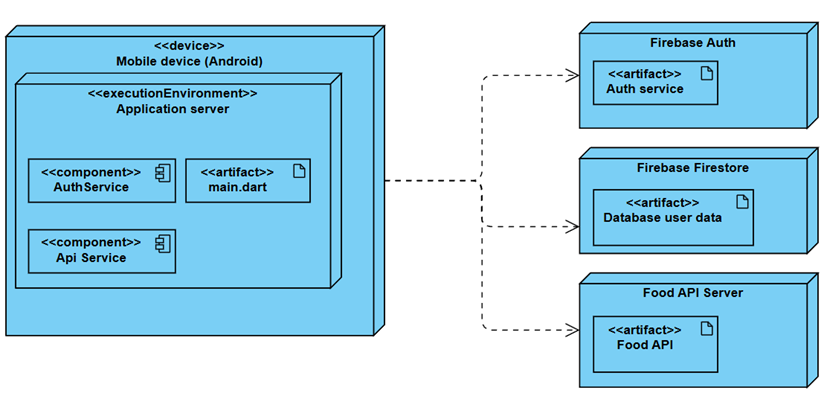

# Food Tracker

Мобильное приложение для отслеживания блюд, которые пользователь уже пробовал.

## 📖 Документация
Полная документация доступна по ссылке:

👉 **https://amorgiov.github.io/FoodTrackerCurs/**

## Основные возможности
- Flutter
- Firebase Authentication
- Внешние Food API
- Отметка «пробовал / не пробовал»

